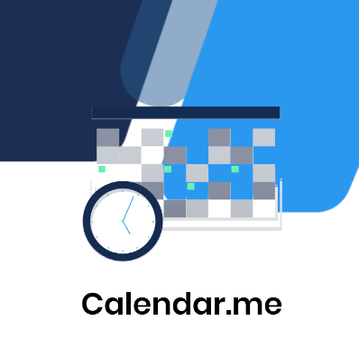

  

  <a href='#About'>About</a>  • 
  <a href='#Features'>Features</a>  • 
  <a href='#About'>To-Do</a>  • 

  

# About
This simple calendar and to-do list application built in Flutter. The intended purpose of this project was to learn Flutter fundamentals while building an application with a purpose. Although simple at the surface, the app incorporates several technologies and concepts within flutter that form a solid foundation for further learning.

# Features

